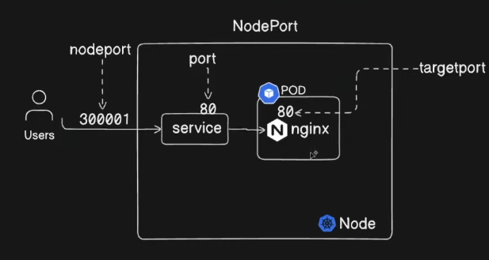

# Chapter 9 - Services

Types of services:

1. ClusterIp
2. NodePort
3. Exernal names
4. Load balancer

Commands:

- `kubectl explain service`
  - `kubectl explain svc`
- `kubectl get pod --show-labels` -> show the labels of the pods
  - `kubectl get pod -o wide` -> show pods and their internal ips
- `kubectl get svc` -> list all services
- `kubectl describe svc mysvc` -> show service details
  - Endpoints field -> list of Pods IPs where the service redirects traffic
- `kubectl expose deployment nginx-deployment --port=80 --target-port=8080` -> create a new service to expose a deployment

## NodePort

Application is exposed on a port of a node

Nodeports range: [30000-32767]

The service can specify a target port -> port where the Pods are listening to

NodePort -> exposed externally, receives traffic from outside

- NodeIP:NodePort

Port -> exposed internally to the cluster, other pods can make requests to this service through this port

Target port -> hidden, the service forwards traffic from NodePort to target port in the target pods



The service will load balance the traffic between its pods

## ClusterIp

Es. I have a frontend and a backend deployment

- Each Pod has an ephemeral internal IP -> not good for networking between frontend and backend
- I want a static IP to communicate between frontend and backend -> use a ClusterIp service

It is the default service type: if no type field is specificed it will be a clusterIp

## Load balancer

The node's IP is not static -> we need a static IP to expose a service to the external world

The load balancer service type relies on a load balancer provided by the cloud provider to distributes traffic between multiple pods

- typically when the service is created, the cloud provider will create a dedicated load balancer
  - if no load balancer is provided, the service will behave as a NodePort service

## External name

Is a DNS-level alias:

- allows pods to acces an external service (expressed by a domain like my.service.com) through a Kubernetes Service

For example:

```yaml
apiVersion: v1
kind: Service
metadata:
  name: external-service
  labels:
    env: demo
spec:
  type: ExternalName
  externalName: my.service.com
```

Now pods can make requests to `external-db.default.svc.cluster.local` which whill be redirected to my.service.com

Pros:

- avoid hardcoding external names in the cluster apps
- point the same service to different externalNames
  - e.g. can create an ExternalName that points to dev.service.com in development, another one which points to my.service.com in production